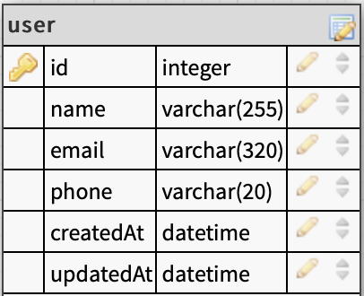

# flojics

[Flojics](https://flojics.com) web developing task

## Part 1 (NodeJS)

---

- ### setup:
  after clonning the reposetory navigate to "node" directory and run the following command on your terminal to donload dependencies:

```bash
npm install
or
yarn install
```

you will need to add `.env` file containing

```
PORT = <the port number where you want to listen at>
CONN_URL = <Rabbitmq connection url>
DB_NAME = <database name>
DB_USER = <database username>
DB_PASS = <database user password>
DB_HOST = <database host>
```

you will have to make sure the database exists with table `user` exist with the following schema:



- ### Run
  To start the server you need to make sure to navigate to the same directory and run the following comand:

```bash
npm serve
or
yarn serve
```

Or `serve` instead of start if you have nodemon installed globaly.

### now the server should be runing and listening on your local host.

---

- ### Usage
  send a POST request to http://localhost:`<PORT>`/user that conatin the following in the body:

```json
"name": "",
"email": "",
"phone": ""

```

And make sure the "email" is a valid email format, "name" length is atleast 5 characters and phone length is atleast 8 digits.

send a GET request to http://localhost:`<PORT>`/user to get all users.

You can use [Postman](https://www.postman.com) to send these requests.

---

- ### Project skeleton
  The entry point of the project is `/src/index.js`
  it contains the definition of the app using [Express](https://expressjs.com).

It also uses express middlewares to parse requests.

It also uses `router` which is imported from `/src/router.js` which contains definition of the API endpoints and the functions executed when calling those endpoints.

`router` use imports from two other files:

1.  `User` from `src/module.js` which is [sequelize](https://sequelize.org/master/) module and is used to get all users from database.

2.  `publishToQueue` which is a function imported from `src/service` which pushes the user details recieved at POST endpoint into the [Rabbitmq](https://www.rabbitmq.com) queue

`service.js` also contain the function that consumes the queue and inserts the users into the database.

---

## Part 2 (symfony)

---

- ### Usage

  An api to get all users in database.

- ### setup
  after clonnig the repository navigate to `symfony` directory create a `.env` file as following:

```env
APP_ENV=dev
APP_SECRET=79d870921b93ed83409c59e9474039ea
DATABASE_URL="mysql://<Database username>:<Database password>@127.0.0.1:3306/<Database name>?serverVersion=5.7"

```

then run command

```bash
symfony server:start
```

then send a GET request to `127.0.0.1:8000/user` to get an array of JSON objects of all users in database.
